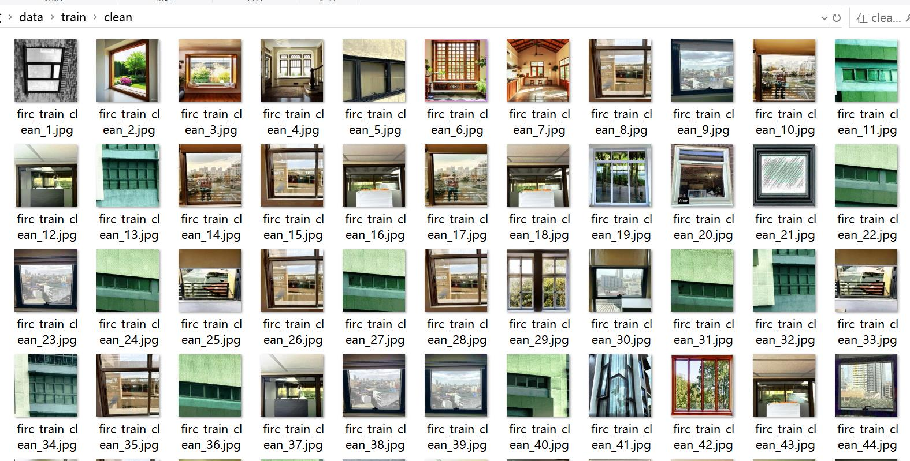
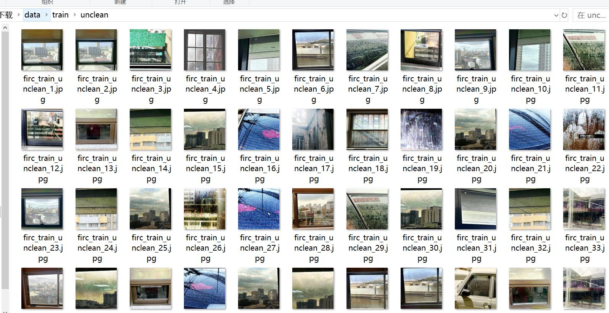

# Windows Cleanliness Category Classification Dataset: 3,299 Images in 2 Categories with Train-Validation-Test Sets

Dataset Type: Image classification for use, not suitable for object detection with no labeled files.
Dataset Format: Only contains JPG images, each category folder contains corresponding images.
Number of Images (JPG File Count): 3,329
Image Resolution: 224x224
Number of Categories: 2
Category Names: ['clean', 'unclean']
Number of Images per Category:
Training set image count: 2,333
- clean training set image count: 1,181
- unclean training set image count: 1,152
Validation set image count: 667
- clean validation set image count: 360
- unclean validation set image count: 307
Test set image count: 329
- clean test set image count: 165
- unclean test set image count: 164
Total Image Count:
- clean total image count: 1,706
- unclean total image count: 1,623
Important Notes: None
Special Disclaimer: This dataset does not guarantee the accuracy of trained models or weight files.
Image Preview:

## Images

Here is a pay link on Stripe ( https://buy.stripe.com/3cs8yP7sY87d0vu9AB ). Please contact me lonlonago@foxmail.com after funding $89, and I will send you a complete data files , thank you!

